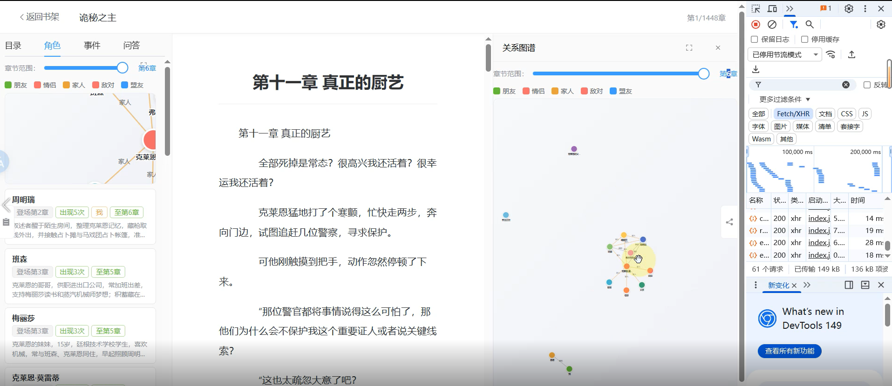
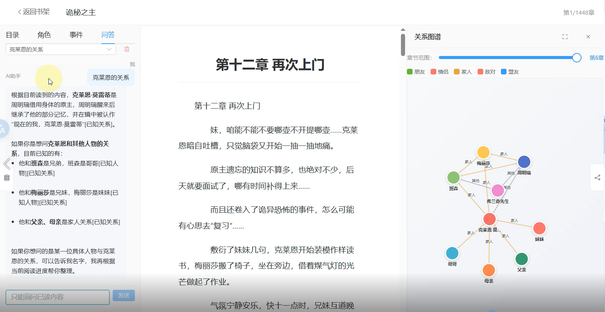
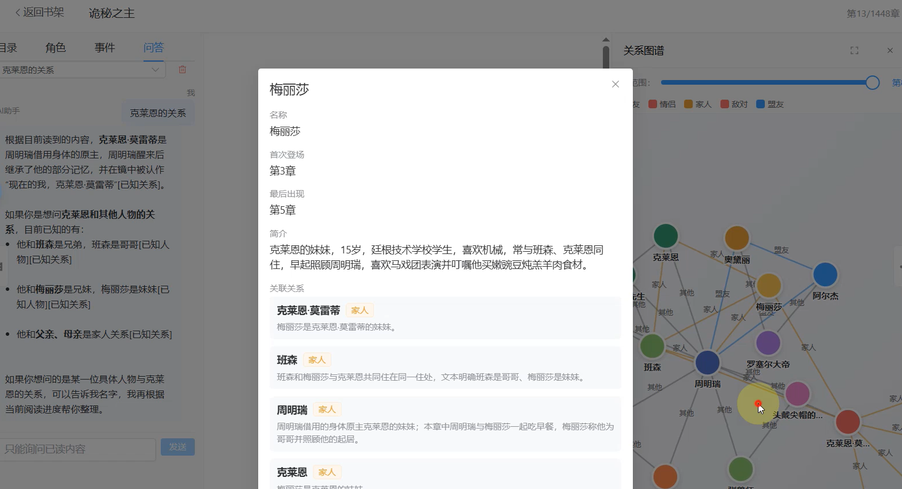
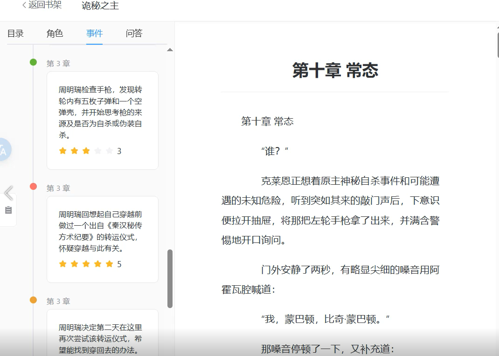

# 注：该项目有大量未完善的地方，是个Demo

# Reader - 中文小说阅读器 (AI 知识提取系统)

基于 AI 的中文小说阅读器，支持智能知识提取与问答。上传小说后，系统自动识别角色、关系与事件，提供按阅读进度的防剧透问答功能。

## 功能

- **小说上传与管理** — 自动检测编码（UTF-8/GBK/GB18030），智能分割章节
- **阅读进度追踪** — 记住每本书的当前章节与阅读位置
- **AI 知识提取** — 后台异步解析已读章节，提取角色（含别名）、人物关系、关键事件
- **防剧透设计** — 仅解析读者已读的章节，知识面板按进度过滤
- **RAG 智能问答** — 基于向量检索（Milvus）+ 结构化知识（SQLite）的上下文增强对话
- **知识图谱可视化** — D3 力导向图展示人物关系网络，时间线展示事件进展
- **多对话管理** — 自动生成对话标题，保留历史上下文

## 技术栈

| 层 | 技术 |
|---|------|
| 后端 | Go 1.24, Gin, GORM, SQLite |
| 前端 | Vue 3, Element Plus, Pinia, D3.js |
| AI | OpenAI 兼容 API（Cloudwego Eino 框架） |
| 向量库 | Milvus v2（可选，支持不启用向量库运行） |
| 编码 | GB18030/GBK 自动识别与转换 |

## 快速开始

### 环境要求

- Go 1.24+
- Node.js 18+
- （可选）Milvus 2.x 实例，用于向量检索

### 后端

```bash
# 编辑 config.yaml，配置 LLM 端点和模型
cp config.yaml config.yaml  # 根据需要修改

# 安装依赖并运行
go mod tidy
go run main.go
# 服务启动在 http://localhost:8080
```

### 前端

```bash
cd frontend
npm install
npm run dev
# 开发服务器启动在 http://localhost:5173，自动代理 /api 到 :8080
```

### 生产部署

```bash
cd frontend && npm run build && cd ..
go build -o reader.exe .
./reader.exe
```

Gin 托管 `frontend/dist/` 作为 SPA 静态文件，前后端合并部署在单一端口。

## 配置

`config.yaml`:

```yaml
llm:
  base_url: "https://your-llm-api/v1"   # OpenAI 兼容 API
  api_key: "sk-xxx"
  model: "gpt-4o-mini"                  # 对话与抽取模型
  embed_model: "text-embedding-3-small" # 向量嵌入模型

milvus:
  address: "localhost:19530"
  db_name: "reader"
  collection: "novel"
  dimension: 1536

server:
  port: "8080"
  db_path: "./data/reader.db"
  books_dir: "./data/books"
```

### 不使用 Milvus

将 `main.go` 中 Milvus 初始化保持注释状态即可。此时问答功能退化为纯结构化知识（SQLite 中的角色/关系/事件）+ 对话历史。向量检索是增强功能，不影响核心使用。

## 工作原理

### 1. 导入流程

```
上传 .txt → 编码检测 → 章节分割 → 存入 SQLite
```

- `pkg/encoding` 通过 BOM 和字节特征检测 GBK/GB18030/UTF-8
- `pkg/chapter` 用正则匹配"第X章"等常见中文小说章节格式

### 2. 后台解析流程

```
更新阅读进度 → ParseManager 调度 → 分块 → LLM 抽取 → 知识融合
```

- 用户每更新一次进度，后台自动触发未解析章节的异步处理
- 每章通过三次 LLM 调用依次提取角色、关系、事件
- `services/merge.go` 处理跨章节知识的去重与合并
- 同一本书同时只有一个解析任务运行（mutex 保护）

### 3. 问答流程

```
用户提问 → 向量检索(Milvus) + 知识库(SQLite) + 对话历史 → LLM → 回答
```

- 系统提示词严格限制"仅使用提供的上下文，禁止透露未读内容"
- 回答中引用来源片段编号

## API 概览

```
POST   /api/books                        # 上传小说
GET    /api/books                        # 书籍列表
GET    /api/books/:id                    # 书籍详情（含章节目录）
GET    /api/books/:id/chapters/:cid      # 章节内容（含上下文导航）
DELETE /api/books/:id                    # 删除书籍
PUT    /api/books/:id/progress           # 更新阅读进度（触发解析）

GET    /api/books/:id/characters         # 角色列表（按进度）
GET    /api/books/:id/relations          # 人物关系（按进度）
GET    /api/books/:id/events             # 事件列表（按进度）

POST   /api/books/:id/ask               # 提问
POST   /api/books/:id/conversations      # 创建对话
GET    /api/books/:id/conversations      # 对话列表
GET    /api/conversations/:id/messages   # 消息历史
DELETE /api/conversations/:id            # 删除对话
```

所有响应格式：`{code: 0, msg: "ok", data: ...}`

## 项目结构

```
main.go              # 入口：初始化 DB → LLM → Milvus → 依赖注入 → 启动
config/              # YAML 配置加载
models/              # GORM 数据模型
handlers/            # HTTP 处理器（薄层，参数校验后委托 service）
services/            # 业务逻辑：导入、解析、合并、问答、任务调度
repository/          # GORM 数据访问层
llm/                 # Eino LLM 客户端封装（Chat + Embed）
milvus/              # Milvus v2 客户端（HNSW + 余弦相似度）
pkg/
  chapter/           # 章节标题识别与分割
  chunker/           # 文本重叠分块器
  encoding/          # GBK/GB18030 编码检测
  envutil/           # 环境变量工具
  response/          # 统一响应封装
router/              # Gin 路由与 SPA 回退
middleware/          # CORS 中间件
frontend/            # Vue 3 SPA（Element Plus + D3 + Pinia）
```

## 说明
由于是异步推理，可能存在你已经看到第十章了，但是LLM才推理到第三章的问题。

## 演示截图



